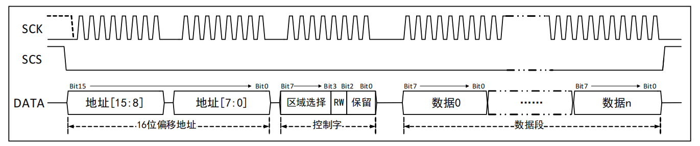

**概述**

- CH394 芯片自带 10/100M 以太网介质传输层 MAC 和物理层收发器 PHY
- 内置 50Ω阻抗匹配电阻，内置 25MHz 晶体振荡器所需电容，外围电路精简
- I/O 口支持 3.3V、2.5V、1.8V、1.2V 供电

- 内置了 IP、ARP、ICMP、IGMP、UDP、TCP 等以太网协议栈固件
- 支持网络唤醒模式（WOL）和掉电模式
- 默认为 IPv4 模式，兼容 IPv4、ARP、ICMP、IGMP、UDP、TCP 等多种网络协议
- IPv6 模式下额外支持 IPv6、ICMPv6、IPRAW4、IPRAW6 等协议
- CH394Q 提供了 SPI 接口
- CH394L 提供了 SPI 接口和 8 位被动并行接口
- CH394Q 支持 8 个 Socket，CH394L 支持 4 个 Socket
- 支持 MACRAW 模式和 IPRAW 模式
- 提供最高 62MHz 速度的 SPI 设备接口（SPI 模式 0 或 3），高位在前

**硬件设计**

电源部分

| 引脚号 | 引脚名 | 说明                                                         |
| ------ | ------ | ------------------------------------------------------------ |
| 4      | AVDD33 | ● 3.3V 主电源输入 ● 建议 0.1uF 并联 10uF 或 4.7uF 对地，或单个 1uF～4.7uF 电容贴近芯片放置 |
| 8      | AVDD33 | ● 3.3V 电源输入 ● 建议外接 0.1uF 或 1uF 对地电容        |
| 20     | AVDDK  | ● 外接 1uF 对地电容贴近芯片放置                              |
| 21、28 | VDDIO  | ● I/O 接口的电源输入 ● 建议 0.1uF 或 1uF 对地电容贴近   |
| 22     | DVDDK  | ● 外接 0.1uF 或 1uF 对地电容贴近芯片放置                     |

指示 LED 部分

| 引脚号 | 引脚名   | 说明                                                      |
| ------ | -------- | --------------------------------------------------------- |
| 24     | LED_SPD  | 网络速度指示 ● 低电平：100Mbps ● 高电平：10Mbps |
| 25     | LED_LINK | 网络连接指示 ● 低电平：已连接 ● 高电平：未连接  |
| 26     | LED_DUP  | 双工指示 ● 低电平：全双工 ● 高电平：半双工      |
| 27     | LED_ACT  | 载波感应指示： ● LED 闪烁表示有载波感应信号          |

晶振部分

| 引脚号 | 引脚名 | 说明                                                         |
| ------ | ------ | ------------------------------------------------------------ |
| 30     | XI     | ● 晶体振荡器输入 ● 需外接 25MHz 晶体一端，或外部时钟输入 ● 内置晶振匹配电容 |
| 31     | XO     | ● 晶体振荡器反相输出 ● 需外接 25MHz 晶体另一端 ● 内置晶振匹配电容 |

中断、复位部分

| 引脚号 | 引脚名 | 说明                                       |
| ------ | ------ | ------------------------------------------ |
| 36     | INT    | 中断请求输出 低电平有效，内置上拉电阻 |
| 37     | RSTB   | 复位输入 低电平有效，内置上拉电阻     |

SPI 部分
| 引脚号 | 引脚名 | 说明         |
| ------ | ------ | ------------ |
| 32     | CS     | 内置上拉电阻 |
| 33     | SCLK   |              |
| 34     | MISO   |              |
| 35     | MOSI   |              |

PHY工作模式部分

| 引脚号 | 引脚名 | 说明         |
| ------ | ------ | ------------ |
| 43     | PMOD2  | 内置上拉电阻 |
| 44     | PMOD1  | 内置上拉电阻 |
| 45     | PMOD0  | 内置上拉电阻 |

| PMOD[2:0] | 说明                             |
| --------- | -------------------------------- |
| 000       | 10M 半双工，关闭自协商           |
| 001       | 10M 全双工，关闭自协商           |
| 010       | 100M 半双工，关闭自协商          |
| 011       | 100M 全双工，关闭自协商          |
| 100       | 100M 半双工，启动自协商          |
| 101       | 保留                             |
| 110       | 保留                             |
| 111       | **启动自协商（建议的默认模式）** |

## SPI 通信部分

CH394Q 支持对数据进行连续的读取或写入操作，从起始地址开始，每传输完一个偏移地址的数

据后，偏移地址会自动加 1 传输接下来的数据。

**数据帧**

CH394Q 数据帧分包含三个部分：

- 16 位偏移地址
  - CH394Q 寄存器地址
  - RX/TX 缓存的偏移地址

- 8 位控制字
  - 界定地址段中设定的偏移区域的所有权，即用于确定是访问以下这些区域中的哪一个
    - CH394Q 有 1 个通用寄存器区，8 个 Socket 寄存器区，8 个接收缓存区与 8 个发送缓存区
  - 确定读/写模式

- N 字节数据段

**8位控制字**

- **Bit[1:0]** 保留

- **Bit[2]** 读/写模式选择位：0 - 主机读，1 - 主机写
- **Bit[4:3]**
  - 01：Socket 的控制寄存器
  - 10：Socket 的发送缓存
  - 11：Socket 的接收缓存

- **Bit[7:5]**

  - 000 ~ 111：Socket 0 ~ 7

- **Bit[7:3]** = 00000 用于访问通用寄存器

  

## 寄存器与缓冲区

- CH394Q 有 1 个通用寄存器区，8 个 Socket 寄存器区，8 个接收缓存区与 8 个发送缓存区

- CH394Q 共有 16K 发送缓存区，8 个 Socket 每个默认 2K；16K 接收缓存区，8 个 Socket 每个默认 2K。

