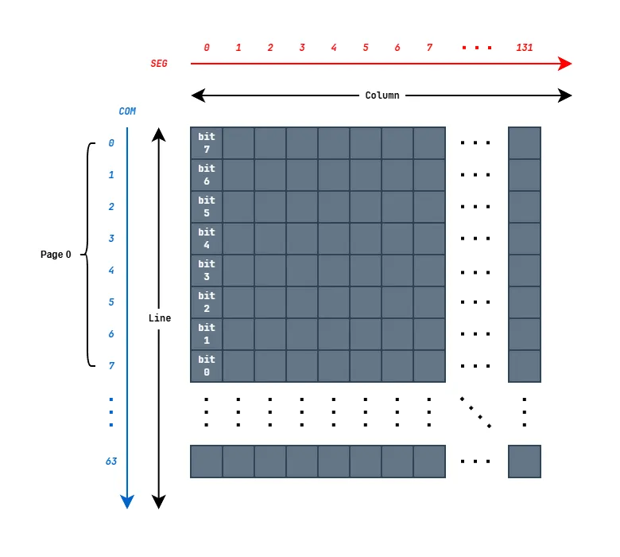

# OLED SH1106 笔记

>[!NOTE]
>
>SH1106的手册中，"A0"是这个屏幕控制器的一个引出焊盘
>
>- 在非 I2C 模式下，这个 "A0" 就是用来区分通信的数据是指令还是显存数据的，也就是 D/C 控制。所以，在手册中看到 "A0" 字眼，其实就是指的 D/C 标志。
>- 在 I2C 模式下，这个 "A0" 就换了一个名字叫 "SA0"，用来作为可配置的 I2C 设备地址。

## 7-PIN-SPI 改 4-PIN-I2C

购买的 1.3 寸 SSH1106 OLED 屏幕是 7-PIN SPI 接口的

| GND  | VCC  | CLK  | MOSI | RST  | DC   | CS   |
| ---- | ---- | ---- | ---- | ---- | ---- | ---- |

可以把 7-PIN SPI 接口改成 4-PIN I2C 接口

| GND  | VCC  | SCL  | SDA  |
| ---- | ---- | ---- | ---- |

除了需要更改通信方式配置电阻外，还需要注意：

- GND 不变

- VCC 不变

- SPI-CLK 信号变为 I2C-SCL 信号

- SPI-MOSI 信号变为 I2C-SDA 信号

- **RST 上拉到 VCC**

  - 也可以直接接到 VCC，推荐加上拉电阻

- **SPI-DC 转变为 I2C 通信设备地址配置的 SA0**

  > [!IMPORTANT]
  >
  > **一定不能悬空**，必须确保设备地址稳定

- **SPI-CS 下拉到 GND**

## I2C 通信

**通信速率**

MAX: 400KHz

 

**设备地址**

> 回顾：I2C 通信时，作为 8-bit 地址的最低位为读/写标志(0:读，1:写)

可通过引脚 SA0 配置 I2C 通信时的设备地址

| SA0  | 7-bit Slave Address | 8-bit Write(0) | 8-bit Read(1) |
| :--: | :-----------------: | :------------: | :-----------: |
|  0   |    0111_100_R/W     |      0x78      |     0x79      |
|  1   |    0111_101_R/W     |      0x7A      |     0x7B      |

### 通信过程

主机发出 START

主机发送从机 SH1106 的地址，0111_10-SA0-R/W

从机 SH1106 应答

发送控制字节：Co-DC-ControlByte. 

- 第7位的 Co=0: 这是最后一个 "控制字节-数据字节对"
- 第7位的 Co=1: 后续还有若干 "控制字节-数据字节对"
- Co 就是 Continuation 连续，想要在一个 START-STOP 间传输多个 "控制字节-数据字节对"，就把控制字节的 Co 位置 1
- 第6位的 DC=0: 本控制字节后紧跟的数据字节是控制命令的操作内容
- 第6位的 DC=1: 本控制字节后紧跟的数据字节是操作显存的

发送数据字节

- SH1106 有针对内部像素显存的数据指针，当主机发送的是显存数据的时候，这个数据指针会自己移动

### 像素布局

**Segment 和 Common**

在 SH1106 的手册中，有这样的描述：

> SH1106 consists of 132 segments, 64 commons that can support a maximum display resolution of 132 X 64. It is designed for Common Cathode type OLED panel.
>
> SH1106拥有132个段极、64个公共极，最高可支持132×64的显示分辨率，专为共阴极型OLED显示屏设计。

Segment 和 Common 在这个地方被翻译为段极和公共极，这在液晶、断码管、数码管中是很常见的概念。

因为也指明了这是驱动共阴极OLED面板的，所以，是每 132 个像素点的阴极是连接在一起，接到一个公共极上。

这里就不多说了，因为我也没有研究太多。提 Segment 和 Common 的关键是后面的像素显示会用到这两个字眼。

手册中存在各种不同的词：Row、Line、Column、垂直、水平

**Page Address 和 Column Address**

- 页地址和列地址是独立的

- 存在页地址设置指令和列地址设置指令

- "Page- 页"

  - 一般的显示面板安装时，尺度大的会被选为水平方向的宽，尺度小的会被选为垂直方向的高。
    - SH1106 支持 132 * 64 面板。
    - 在手册中，132 这个水平尺度就被称为 "Column - 列"，64 这个垂直尺度被称为 "Row - 行" 或者 "Line - 行"
  - 因为是单色屏，一个像素点只需要一个 bit 的数据量就可以表示。所以在垂直方向上，将 8 个像素点的数据打包为 1 个字节

- "Column - 列" 在此 OLED 控制器中，和 "Segment - 段极" 对应

  - SH1106 有 132 个 "Column - 列"，列地址范围：0 ~ 131 (0x00 ~ 0x83)

  - 前面说过，通信时读写显存数据 (主要是写)，数据指针会自己移动 (自增)。这个数据指针就是 "Column - 列" 指针。

  - 列指针的移动只会在当前页内回转，也就是说，当指针指向 0x83 列的时候，自增之后的指针下一次就会指向 0x00 列 (当然，这是在默认的列分布方向的情况)

  - 支持 "Column - 列" 反转。

    - 本来 "Column - 列" 和 "Segment - 段极" 是对应，第 0x00 列对应第 0x00 段。通过列反转指令，可以让第 0x83 列对应第 0x00 段，第 0x00 列对应第 0x83 段。
    - 列反转相当于镜像显示。
    - 同理，"Common - 公共极" 也存在反转功能。

    

**Line Address**

> [!NOTE]
>
> SH1106 的手册中，在垂直尺度上 "Line" 和 "Row" 混用，"Row" 字眼出现的很少，看到的时候还是有些费解。
>
> 在此器件中，它们是一个概念：行。

- "Line - 行" 和 "Common - 公共极" 对应

- SH1106 有 64 个 "Line - 行" ，范围：0 ~ 63 (0x00 ~ 0x3F)

- 支持行反转。

  默认第 0x00 行对应第 0x00 公共极。通过行反转指令，可以让第 0x3F 行对应第 0x00 公共极，第 0x00 行对应第 0x3F  公共极。

- 支持设置首行位置。可以不需要重绘显存实现显示滚动效果。

**示意图**

说明：

- 固定的内容
  - SEG 的编号排列顺序
  - COM 的编号排列顺序
