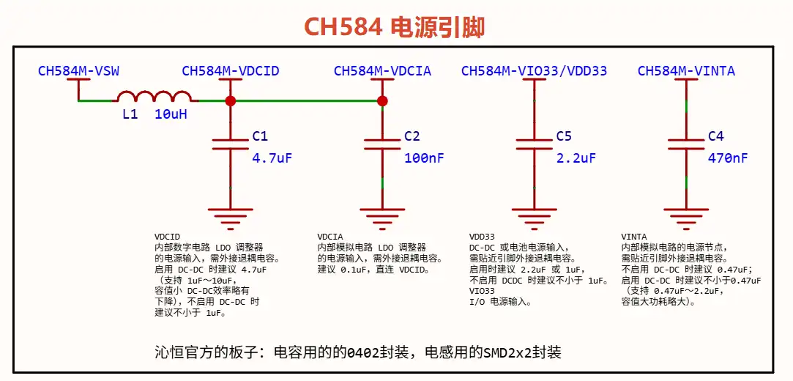

# CH584 引脚笔记

## 电源引脚

- **VDCID**

  > 内部数字电路 LDO 调整器的电源输入，需外接退耦电容。
  >
  > 启用 DC-DC 时建议 4.7uF（支持 1uF～10uF，容值小 DC-DC效率略有下降），不启用 DC-DC 时建议不小于 1uF。

- **VDCIA**

  > 内部模拟电路 LDO 调整器的电源输入，需外接退耦电容。
  >
  > 建议 0.1uF，直连 VDCID。

- **VSW**

  > DC-DC 开关输出，启用 DC-DC 时必须贴近引脚串接电感连接 VDCID，建议用 10uH 电感（支持 4.7uH～22uH，感值小 DC-DC 效率略有下降），不启用 DC-DC 时可以直连VDCID。

- **VDD33 / VIO33**

  *这两个引脚在芯片引出时合并为一个引脚了*

  - **VDD33**

  > DC-DC 或电池电源输入，需贴近引脚外接退耦电容。
  >
  > 启用时建议 2.2uF 或 1uF，不启用 DCDC 时建议不小于 1uF。

  - **VIO33**

  > - I/O 电源输入。

- **VINTA**

  > 内部模拟电路的电源节点，需贴近引脚外接退耦电容。
  >
  > 不启用 DC-DC 时建议 0.47uF；启用 DC-DC 时建议不小于0.47uF（支持 0.47uF～2.2uF，容值大功耗略大）。

  

  

