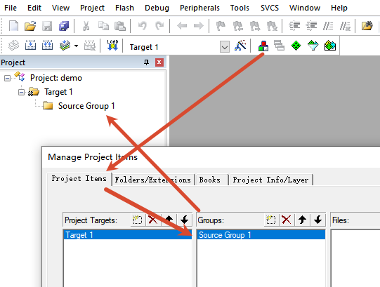

# MDK5-KEIL工程虚拟文件夹规范

> 虚拟文件夹是指如下所示的在 Project 区展示的文件管理方式

---

## 虚拟文件夹

|                    |                                                              |
| ------------------ | ------------------------------------------------------------ |
| `src / main`       | 主函数等                                                     |
| `src / mcu-device` | 芯片启动文件等 cmsis 标准文件和厂商提供的芯片配置程序等。 与芯片外设几乎没有关系(时钟除外)。 |
| `src / libs`       | 工程在使用子模块时的一些接口、配置等文件。                   |
| `libs / xxxxx`     | 子模块源码。                                                 |
| `docs`             | 文档。                                                       |

