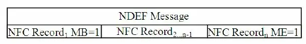
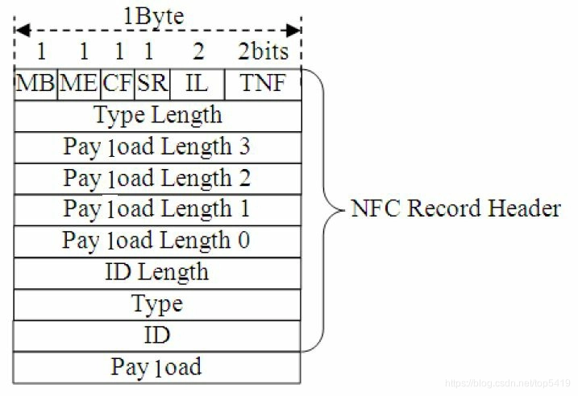
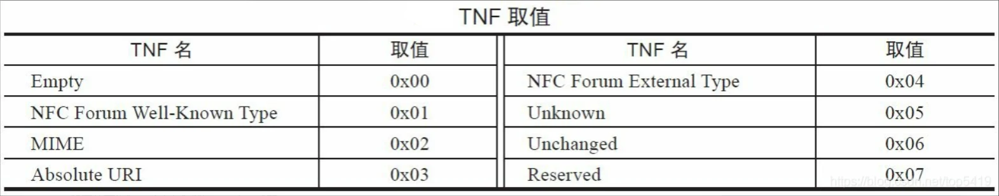
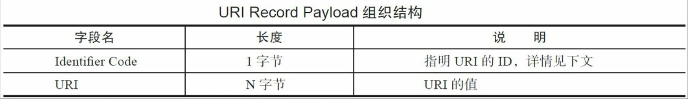
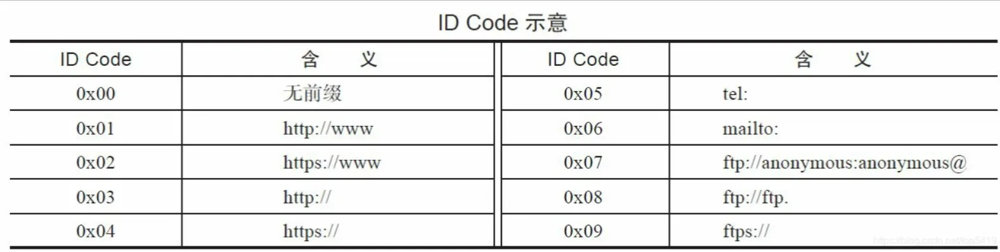
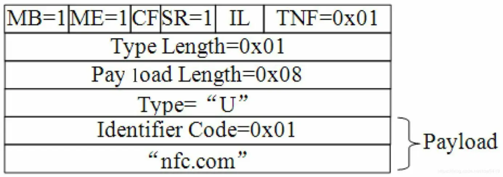
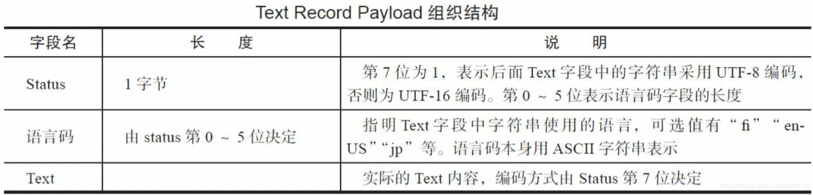
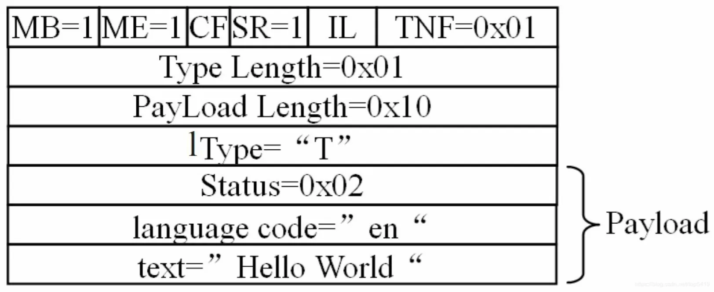

#  NDEF (NFC 数据交换格式)

> 相关术语：
>
> - NDEF : NFC Data Exchange Format
>
> - NFC Record
> - NFC Forum
>
> - RTD : Record Type Definition
> - MIME : Multipurpose Internet Mail Extensions 多用途互联网邮件扩展
> - TNF : Type Name Format

## NDEF 和 NFC Record 之间的关系

根据 `NFC Forum` 的定义：

- `R/W` 模式下，NFC 设备之间每一次交互的数据都会封装在一个 `NDEF Message` 中
- 而一个 `NDEF Message` 可以包含多个 `NFC Record`
- 真正的数据则封装在 `NFC Record` 中
- 下图展示了 `NDEF Message` 和 `NFC Record` 之间的关系。

由上图可知：

- 一个 `NDEF Message` 可包含一个或多个 `NFC Record`

- 在一个 `NDEF Message`中

  - 第一个 `NFC Record` 需置其 `MB` (`Message Begin`) 位为 1，表示它是该 `NDEF Message` 中的第一个 `NFC Record`

  - 最后一个 `NFC Record` 需设置 `ME` (`Message End`) 位为 1，表示它是该 `NDEF Message` 中最后一个 `NFC Record`

## NFC Record 数据结构

`NFC Record` 本身的组织结构如下所示

`NFC Record` 分为两大部分

- `NFC Record Header`（头部信息）
- `Payload`（数据载荷）

### Record Header

`Record Header` 中最重要的是其第一字节。该字节有 6 个标志信息，分别如下

1. `MB`（`Message Begin`）
2. `ME`（`Message End`）
3. `CF`（`Chunk Flag`）
   - 表示该 `Record` 是否为分片 `Record`
4. `SR`（`Short Record`）
   - 如果该标志被设置，则图中的 4 个 `Payload Length` 字段仅需一个，这表明 `Payload` 数据长度将限制在 255 字节以内
5. `IL`（`ID Length`）
   - 用于指明 `Header` 中是否包含 `ID Length` 和 `ID` 这两个字段
6. `TNF`（`Type Name Format`）
   - 用于指明 `Payload` 的类型，`NFC Forum` 定义了一些常用的 `Payload` 类型，详情见下文分析

`Record Header` 其他字节如下

1. `Type Length`

   - 指明 `Record Header` 中 `Type` 字段的长度

2. `Payload Length` 

   - 指明 `Payload` 字段的长度
   - 如果 `SR` 标志被设置，则 `Record Header` 仅包含一个 `Payload length` 字节

3. `ID Length`

   - 指明 `ID` 字段的长度。如图所示 `IL` 标志未设置，则 `ID Length` 和 `ID` 字段都不存在

4. `Type`

   - 表明 `Payload` 的类型
     `NFC Forum` 定义了诸如 `URI`、`MIME` 等类型的 `Type` ，其目的是方便不同的应用来处理不同 `Type` 的数据，例如 `URI` 类型的数据就交给浏览器来处理

5. `ID`

   需要配合 `URI` 类型的 `Payload` 一起使用，它使得一个 `NFC Record` 能通过 `ID` 来指向另外一个 `NFC Record`。

## TNF

`TNF` 用于描述一个 `NFC Record` 中 `Payload` 的类型，为了方便应用程序能正确解析 `NFC Record` 中的数据，`NFC Forum` 规定了一些常用的数据类型，如下图所示

目前 NFC 支持七种数据类型：

1. `Empty`

   - 表示该 `Record` 中没有数据，即相当于一个空的 `NFC Record`

2. `NFC Forum Well-Known Type`

   - 由 `NFC Forum` 定义的一些较为常用的数据类型，包括 `URI`、`TEXT` 等

   - 其格式遵循 `NFC Forum RTD（Record Type Definition）` 规范，下文将介绍

3. `MIME`

   - `Multipurpose Internet Mail Extensions` 的缩写，遵循 RFC2046 规范

   - 例如，当 `TNF` 取值为 `MIME` 时，其 `Type` 字段取值可为 `"text/plain"` 或 `"image/png"` 等

4. `Absolute URI`

   - 绝对 `URI`，遵循 `RFC 3986` 规范

   - 例如，某文件的绝对 `URI` 为 `"http://android.com/robots.txt"`，而其相对 `URI` 则为 `"robots.txt"`。

5. `NFC Forum External Type`

   - 也由 `NFC Forum` 的 `RTD` 规范定义，下文将介绍它

6. `Unknown`

   - 代表 `Payload` 中的数据类型未知

   - 它和 `MIME` 类型 `"application/octet-stream"` 有些类似，这种类型的数据由相应的应用程序来解析

7. `Unchanged`

   这种类型的数据用于 `NFC Record` 分片。

   例如一个大的数据需要通过多个NFC Record来承载，除第一个 NFC Record 分片外，该数据对应的其他 `NFC Record` 分片都必须设置TNF为 `Unchanged` 。

   关于这部分内容，读者可参考 NDEF 规范的2.3.3节 `"Record Chunks"`

   在 `TNF` 七大类型中，`NFC Forum` 通过 `RTD` 规范定义了其中的 `WKT（Well-KnownType）`和`External Type` 两种类型。

`WKT` 是 `NFC Forum` 自己定义的一些常用数据类型，目前常用类型如下

- `URI Record Type`
  - 用于存储 `URI` 数据，对应 `Type` 字段取值为 `U`
- `Text Record Type`
  - 用于存储文本数据，对应 `Type` 字段取值为 `T`
- `Signature Record Type`
  - 用于存储数字签名数据，对应 `Type` 字段取值为 `Sig`
- `Smart Poster Record Type`
  - 智能海报，用于存储与该海报相关的一些资讯信息，如图片、相关介绍等，对应 `Type` 字段取值为 `Sp`
- `Generic Control Record Type`
  - 用于传递控制信息，对应 `Type` 字段取值为 `Gc`
- `External Type`
  - 为第三方组织定义的类型，目前 `NFC Forum` 没有定义相关的数据类型。

## NFC Record 实例

### URI Record Type 实例

`URI Record Type` 属于 `NFC Forum Well-known Type` 的一种，其对应的 `Type` 字段取值为 `U`。

对于这种类型的 `NFC Record`，其 `Payload` 组织结构如表所示

在 `URI Record Payload` 中，第一个字节指明 `URI` 的 `ID` 码，下表为 `NFC Forum` 定义的几种 `ID`码

了解上述信息后，来看  `http://www.nfc.com `这样的信息该如何封装为一个 `NDEF` 消息，下图所示为`NDEF` 消息各字段的取值情况

- 由于该 `NDEF` 消息只包含一个 `NFC Record`，所以这个唯一的 `NFC Record` 将设置 `MB` 和 `ME` 标志位为 `1` 。
- 由于数据量小于 255 字节，所以 `SR` 标志位为 `1`。
- 该 `Record` 携带的数据属于 `URI` 类型，它为 `Well-Known Type` 的一种，所以 `TNF` 取值为 0x01。
- `Type Length` 字段取值为 `0x01` ，对应的 `Type` 字段取值为 `U`，代表 `URI RecordType`
- 根据本节对 `URI Record` 的介绍，这种类型 `Record` 的 `Payload` 包含 `ID Code` 和 `data` 两个
  部分。
  - `ID Code` 取值为 `0x01` 占据 1 字节（代表 `http://www` ）
  - `data` 为 `nfc.com` 占据 7 字节
  - 所以整个 `Payload` 长度为 8 字节，故 `Payload length` 字段取值为 0x08。

当应用程序获取 `Payload` 信息后，将根据 `ID Code` 和 `Data` 的取值最终计算出对应的 `URI` 为 `http://www.nfc.com`

### Text Record Type实例

`Text Record Type` 和 `URI Record Type` 类似，其 `Payload` 组织结构如下表所示。

