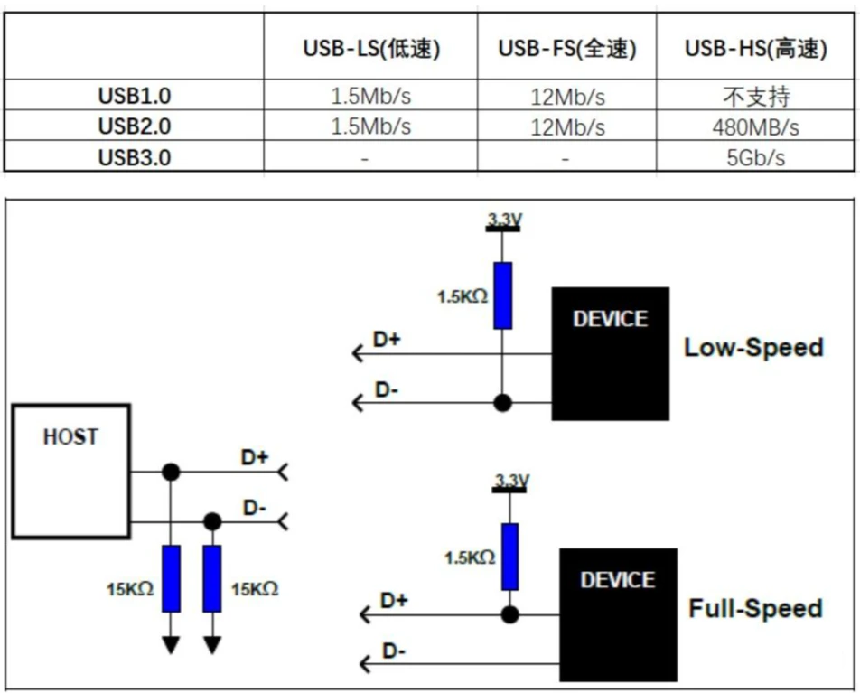
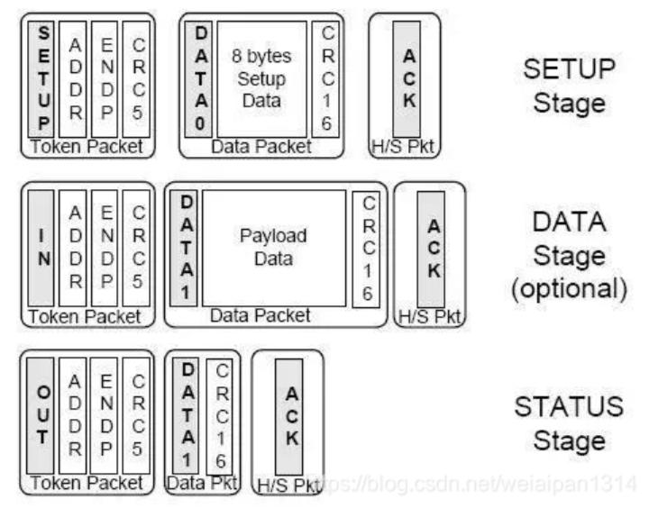

USB协议版本

- USB 1.0/1.1(low/full speed)，传输速率最大为12Mbps
- USB 2.0(high speed)，传输速率最大480Mbps
- USB 3.0(super speed)，传输速率最大5Gbps

协议版本向下兼容


**低速**设备与**全速**设备通过硬件上拉电阻区分 。

高速设备与全速设备均是 D+上拉 ，高速设备在枚举过程中 host 通过高速设备总线特有的电平序列得知设备类型。

硬件上， USB主机的数据线 D+ D- 上存在下拉电阻 Rpd ， 设备未插入前 ， D+,D-均为低电平；设备端全速与高速设备的 D+ 上存在一个可控上拉电阻 Rpu , 在设备插入后 ， D+ 将由低电平逐渐变为高电平(内部存在电容) ， 此时主机与设备均能检测到此信号。




传输方式

USB endpiont 有四种类型，分别对应了不同的数据传输方式，分别为

- Control transfers 控制传输
  - 控制传输通常用于配置设备，获取设备信息，发送命令到设备

- Interrupt transfers 中断传输

- Bluk Data transfers 批量传输

- Isochronous Data Tranfers 等时传输


Interface

一个逻辑设备可能包含若干个接口，每个接口包含1个或多个端点。

每个接口表示一种功能。

一个接口对应一个驱动程序。

例如 usb 扬声器就包含一个键盘接口和一个音频流接口


描述符

```
+------设备描述符
	+----------配置描述符1
		+----------接口描述符1
			+----------端点描述符1
			+----------端点描述符2
			+....
		+----------接口描述符2
         	+----------端点描述符1
       		+....
        +....
	+----------配置描述符2
		+----------接口描述符1
        	+----------端点描述符1
        	+----------端点描述符2
      		+....
   		+....
	+....
```


设备描述符

一个设备只有一个设备描述符，包含了设备类型、设备遵循的协议、厂商ID、产品id、序列号等，一个完整的设备描述符如下

```
DEVICE DESCRIPTOR
    bLength				: 18
    bDescriptorType		: 0x01 (DEVICE)
    bcdUSB				: 0x0200
    bDeviceClass		: Vendor Specific (0xff)
    bDeviceSubClass		: 255
    bDeviceProtocol		: 255
    bMaxPacketSize0		: 64
    idVendor			: Marvell Semiconductor, Inc. (0x1286)
    idProduct			: Unknown (0x812a)
    bcdDevice			: 0x0000
    iManufacturer 		: 3
    iProduct			: 2
    iSerialNumber		: 0
    bNumConfigurations	: 1
```


配置描述符 (configrue description)

一个设备同一时刻只能有一种配置生效

```
CONFIGURATION DESCRIPTOR
    bLength						: 9
    bDescriptorType				: 0x02 (CONFIGURATION)
    wTotalLength				: 121
    bNumInterfaces				: 4
    bConfigurationValue			: 1
    iConfiguration				: 0
    Configuration bmAttributes	: 0xc0  SELF-POWERED  NO REMOTE-WAKEUP
		bit7 Must be 1			: Must be 1 for USB 1.1 and higher
        bit6 Self-Powered		: This device is SELF-POWERED
        bit5 Remote Wakeup		: This device does NOT support remote wakeup
    bMaxPower					: 250  (500mA)
```


接口描述符(interface description)

一个 interface 就代表一个设备。

USB interface 用来处理一类 USB 逻辑连接，例如一个鼠标，一个键盘，或者一个音频流

一些 USB 设备有多个接口，也就是复合设备，例如一个 USB 扬声器可能有 2 个接口: 一个 USB 键盘给按钮和一个 USB 音频流

```
INTERFACE DESCRIPTOR (2.0): class Vendor Specific
    bLength					: 9
    bDescriptorType			: 0x04 (INTERFACE)
    bInterfaceNumber		: 2
    bAlternateSetting		: 0
    bNumEndpoints			: 2
    bInterfaceClass			: Vendor Specific (0xff)
    bInterfaceSubClass		: 0x00
    bInterfaceProtocol		: 0x00
    iInterface				: 8

```


端点描述符(endpoint description)

端点是 USB 通信的基本物理单位，一个端点只能承载一个方向的数据。

端点分为如下几种：

- CONTROL
  控制端点被用来允许对 USB 设备的不同部分存取
  通常用作配置设备、获取关于设备的信息、发送命令到设备、或者获取关于设备的状态报告
  这些端点在尺寸上常常较小
  每个 USB 设备有一个控制端点称为"端点 0", 被 USB CORE 用来在插入时配置设备
  这些传送由 USB 协议保证来总有足够的带宽使它到达设备

- INTERRUPT
  中断端点在每次 USB 主请求设备数据时，以固定的速率传送小量的数据
  这些端点对 USB 键盘和鼠标来说是主要的传送方法
  它们还用来传送数据到 USB 设备来控制设备, 但通常不用来传送大量数据
  这些传送由 USB 协议保证来总有足够的带宽使它到达设备

- BULK
  块端点传送大量的数据
  这些端点常常比中断端点大(它们一次可持有更多的字符)
  它们是普遍的, 对于需要传送不能有任何数据丢失的数据
  这些传送不被 USB 协议保证来一直使它在特定时间范围内完成
  如果总线上没有足够的空间来发送整个 BULK 报文, 它被分为多次传送到或者从设备
  这些端点普遍在打印机、存储器和网络设备上

- ISOCHRONOUS
  同步端点也传送大量数据，但是这个数据常常不被保证它完成
  这些端点用在可以处理数据丢失的设备中, 并且更多依赖于保持持续的数据流
  实时数据收集,，例如音频和视频设备，一直都使用这些端点

```
ENDPOINT DESCRIPTOR
    bLength					: 7
    bDescriptorType			: 0x05 (ENDPOINT)
    bEndpointAddress		: 0x86  IN  Endpoint:6
        1... .... = Direction: IN Endpoint
        .... 0110 = Endpoint Number: 0x6
    bmAttributes			: 0x02
        .... ..10 = Transfertype: Bulk-Transfer (0x2)
    wMaxPacketSize			: 512
        .... ..10 0000 0000 = Maximum Packet Size: 512
    bInterval				: 0
```


class
用来描述设备属于哪种设备，例如音频、键盘、U盘等

设备通过 class 来确认和加载相应的驱动。class分为 device class 和 interface class

class 包含 class、subclass、protocol。组合在一起，用来指出设备具体功能。

```
DEVICE DESCRIPTOR
    bLength				: 18
    bDescriptorType		: 0x01 (DEVICE)
    bcdUSB				: 0x0200
    bDeviceClass		: Miscellaneous (0xef)
    bDeviceSubClass		: 2
    bDeviceProtocol		: 1 (Interface Association Descriptor)
    bMaxPacketSize0		: 64
    idVendor			: Marvell Semiconductor, Inc. (0x1286)
    idProduct			: Unknown (0x4e31)
    bcdDevice			: 0x0100
    iManufacturer		: 1
    iProduct			: 2
    iSerialNumber		: 3
    bNumConfigurations	: 1
```

```
INTERFACE DESCRIPTOR (1.0): class CDC-Data
    bLength				: 9
    bDescriptorType		: 0x04 (INTERFACE)
    bInterfaceNumber	: 1
    bAlternateSetting	: 0
    bNumEndpoints		: 2
    bInterfaceClass		: CDC-Data (0x0a)
    bInterfaceSubClass	: 0x00
    bInterfaceProtocol	: No class specific protocol required (0x00)
    iInterface			: 5
```


---


主机以控制传输(Control Transfer)的方式，通过端点0(Endpoint 0)对设备发送各种请求，设备收到主机发来的请求后回复相应的信息，进行枚举（Enumerate）操作。所有的USB设备必须支持标准请求 StandardRequests），控制传输方式（Control Transfer）和端点0（Endpoint 0）。


一个【传输（Transfer）】(控制、批量、中断、等时)：由多个【事务（Transaction）】组成
一个【事务（Transaction）】(IN、OUT、SETUP)：由一多个【Packet】组成。


控制传输分为三个阶段：①建立阶段。②数据阶段。③确认阶段。

- 建立阶段 setup stage
  - 都是由USB主机发起，
  - 它是一个setup数据包，里面包含一些数据请求的命令以及一些数据。
  - 如果建立阶段是输入请求，那么数据阶段就要输入数据；
  - 如果建立阶段是输出请求，那么数据阶段就要输出数据。
- 数据阶段 data stage (视情况而定，不一定存在)
  - 如果在数据阶段，即便不需要传送数据，也要发一个0长度的数据包。
  - 数据阶段过后就是确认阶段。
- 确认阶段 status stage
  - 确认阶段刚好跟数据阶段相反，
  - 如果是输入请求，则它是一个输出数据包；
  - 如果是输出请求，则它是一个输入数据包。
  - 确认阶段用来确认数据的正确传输




USB除了EP0外，其它的EP都是有方向的，如果从机有数据要上发，先放到对应的EP的buf中，最迟等一个frame就会被 host 主动读走。