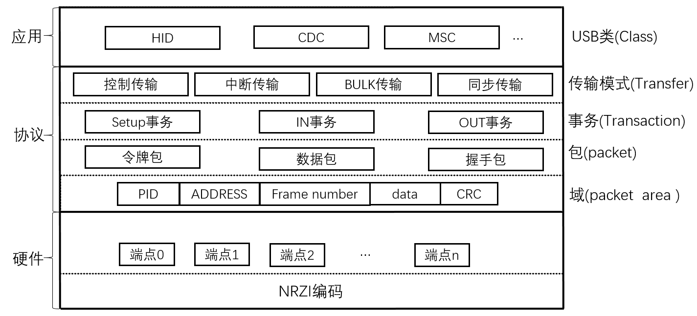
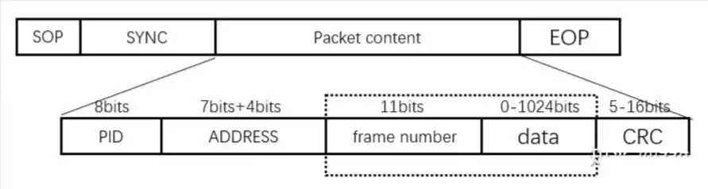
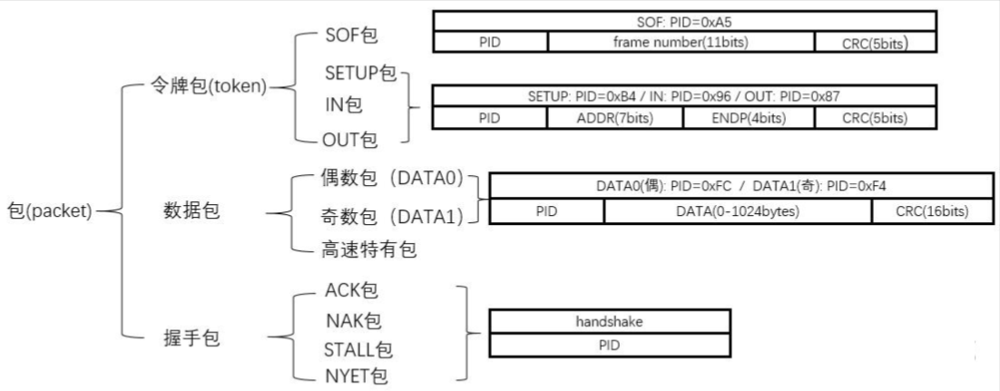
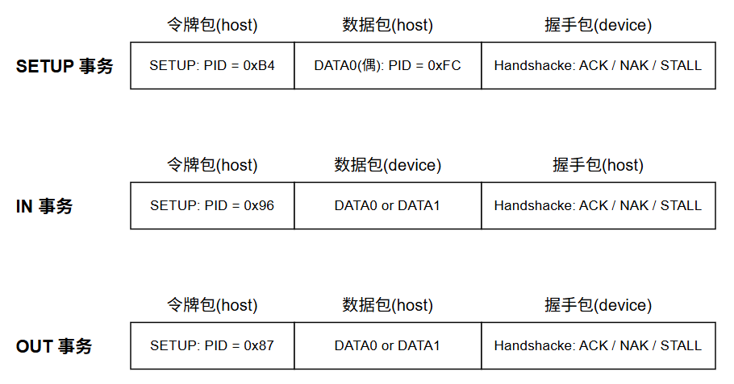
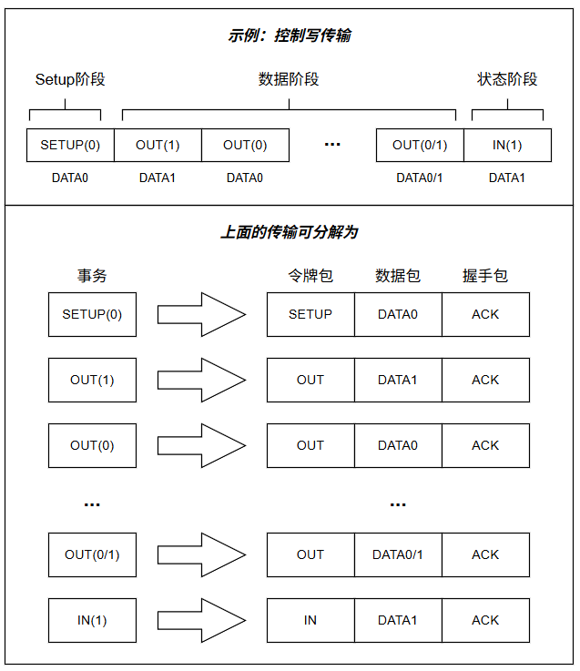
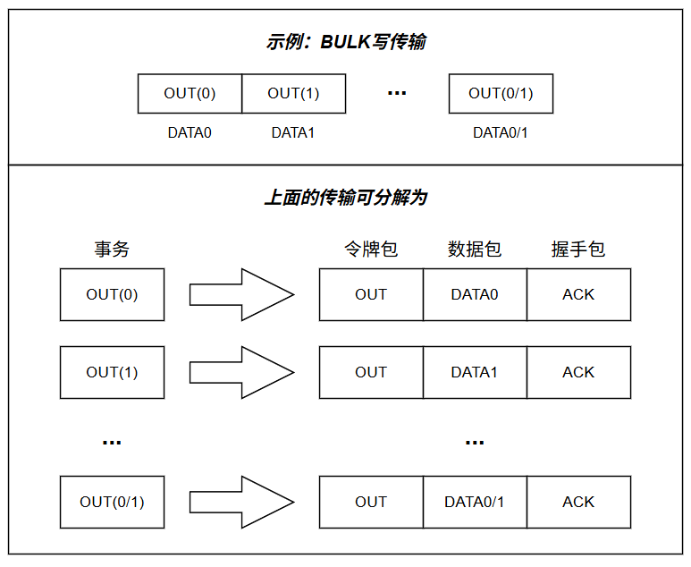
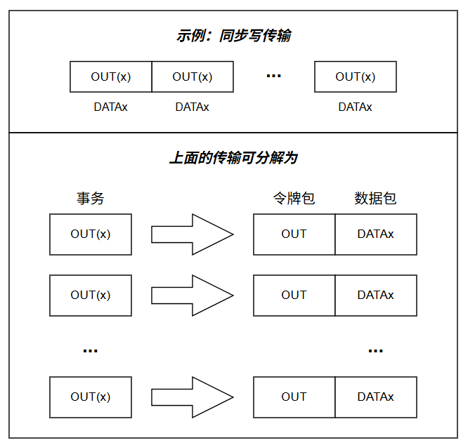
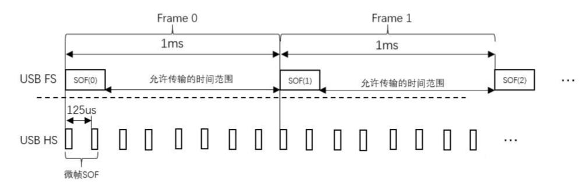
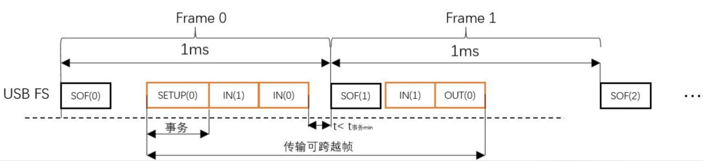

[深入浅出理解USB协议 - 知乎](https://zhuanlan.zhihu.com/p/683251257)

---

### 包

- SOP ： (start of packet) 包的起始信号 ，是一种特殊的电平信号 ，类似 I2C 的 start 信号
- SYNC： 同步信号 ，用于消除通信过程中的相位误差
- EOP：包的结束信号，类似 I2C 的 stop 信号
- packet content
  - PID ：包的标识符 ，通过此字段标识包的类型 ： 令牌包 ， 数据包 ，握手包 ，特殊包
  - ADDRRESS : 7bits 的设备地址 (一个host最多连接127个device) , 4bits的端点地址 (最多支持16个端点)
  - Frame number: 帧号 ，只在特定的包里面存在
  - data : 数据域 ， 最大1024字节 ，可为 0 字节
  - CRC ： 包内容 CRC 校验

### 事务

### 传输

#### 控制传输

控制传输固定使用端点 0 

枚举过程使用大量的控制传输

控制传输为了保证配置数据的传输的有效性，使用了指令再确认机制 

​	通信双方初始通信参数相同，能正确通信 ，

​	某时刻host 希望更改通信参数 ， 

​		host发送修改参数请求 ，

​		devices收到请求并校验配置有效 ，应答host ，但**配置此时不更新** ，

​		主机在收到应答后，判断为正响应，主机给 device 发送确认信息，

​		device 回应答，双方同步更新配置 ，保证后续使用新的配置继续通信

#### BULK传输

BULK 传输多用于大容量存储(U盘) 

传输速率受系统占用率影响，可以粗略理解为，当系统占用率为70%时，剩余30%的 性能用于BULK传输

相对于PC 的 CPU 主频，可能只需要很小的的性能就能跑满 BULK传输的带宽。

一个生活中的实例：当电脑非常卡或者某个应用程序完全卡死时，U盘的拷贝速率会受极大影响。

BULK传输的速率取决于主机 IN 或 OUT 事务的间隔，系统占用率高，IN 或 OUT 事务间隔可能就变大，系统占用率小，IN 或OUT事务间隔可能减小。

#### 中断传输

中断传输在格式上与 BULK 传输没有任何区别

BULK 传输速率不确定是因为 IN 或 OUT 事务是在其他任务空闲时发出，而中断传输的 IN 或 OUT 事务则是定时发出

定时周期取决于设备端点的配置，全速设备最小间隔 1ms ， 高速设备最小间隔 125us 

因此相对于 BULK 的传输，中断传输的**实时性**得到了提高，但整体的**速率被限制**（全速64KB/s）, 中断传输多用于数据量小，实时性高的设备，如 HID 设备。

#### 同步传输

同步传输综合了BULK传输的整体速率，以及中断传输的实时性，

但是去掉了事务的应答，不具备错误重发机制，

多用于音视频传输允许少量错误失真地方。

为了兼顾速度与实时性 ， 同步传输的 IN 和 OUT 事务优先机很高 ，因此只要系统占用率没有达到 100% ， 几乎均可发出 IN 和 OUT 事务，且间隔都是尽可能的短。

BULK传输类似系统在空闲任务中才开始传输，若系统空闲时间长，BULK传输在此空闲阶段也能跑满带宽，同步传输类似在高优先级任务中运行，系统性能尽可能去满足传输速率

## 帧

USB 协议规定 ，在时间线上，USB 传输分为 1ms 间隔的帧，

主机在初始化完成后，会以 1ms 的周期发送 SOF 包，

每发送一包SOF，SOF中的帧计数器加1 ，满后自动翻转。

而前面所介绍的4种传输模式，必须发生在上图的允许传输的时间范围。

其中，**传输可跨越帧 ， 事务与包均不能跨越帧**。

帧的引入有以下用途

- 实现总线上的设备休眠功能 ， 设备 3ms 未收到 SOF 会挂起，挂起的设备可选择进入休眠模式 ，再次收到 SOF 会被唤醒
- 主机和设备都存在 SOF 中断 ，能在时间上进行一个同步
- 中断传输需要定时发起传输事务 ， 定时时间为 1ms 的整数倍，可借助此中断。
- SOF 的帧计数器在高速传输中有作用