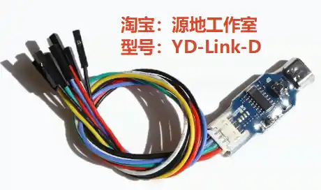

# 调试器 WCH-Link

## 官方资料

> 用户手册：[WCH-LinkUserManual.PDF - 南京沁恒微电子股份有限公司](https://www.wch.cn/downloads/WCH-LinkUserManual_PDF.html)
>
> 上一个资料中打包了用户手册，避免有新的版本，最好都下载看一下

> 原理图: [WCH-LinkSCH.PDF - 南京沁恒微电子股份有限公司](https://www.wch.cn/downloads/WCH-LinkSCH_PDF.html)

> 调试器固件: [WCH-LinkUtility.ZIP - 南京沁恒微电子股份有限公司](https://www.wch.cn/downloads/WCH-LinkUtility_ZIP.html)
>
> WCH-Link 的固件和用户手册被打包在此资料中

> 固件更新工具: [WCHISPTool_Setup.exe - 南京沁恒微电子股份有限公司](https://www.wch.cn/downloads/WCHISPTool_Setup_exe.html)
>
> 注意: 下载的安装程序名为 WCHISPTool_Setup，安装后软件名为 WCHISPStudio

## WCH-Link 系列

### Link 功能和性能对比表

（摘自《WCH-Link 使用说明 V2.7》）

|          功能项           |                       WCH-Link-R1-1v1                        |                       WCH-LinkE-R0-1v3                       |            WCH-DAPLink-R0-2v0             |                       WCH-LinkW-R0-1v1                       |
| :-----------------------: | :----------------------------------------------------------: | :----------------------------------------------------------: | :---------------------------------------: | :----------------------------------------------------------: |
|        使用的芯片         |                            CH549G                            |                          CH32V305F                           |                CH32V203G8R                |                          CH32V208G                           |
|        RISC-V 模式        |                              ✔                               |                              ✔                               |                                           |                              ✔                               |
|   ARM-SWD 模式-HID 设备   |                                                              |                                                              |                     ✔                     |                                                              |
| ARM-SWD 模式-WINUSB 设备  |                              ✔                               |                              ✔                               |                     ✔                     |                              ✔                               |
|  ARM-JTAG 模式-HID 设备   |                                                              |                                                              |                     ✔                     |                                                              |
| ARM-JTAG 模式-WINUSB 设备 |                                                              |                              ✔                               |                     ✔                     |                              ✔                               |
|     ModeS 键切换模式      |                                                              |                              ✔                               |                     ✔                     |                              ✔                               |
|   两线方式离线升级固件    |                                                              |                              ✔                               |                                           |                                                              |
|     串口离线升级固件      |                              ✔                               |                                                              |                                           |                                                              |
|     USB 离线升级固件      |                              ✔                               |                                                              |                     ✔                     |                              ✔                               |
|   3.3V/5V 电源输出可控    |                                                              |                              ✔                               |                     ✔                     |                              ✔                               |
| 高速 USB2.0 转 JTAG 接口  |                                                              |                              ✔                               |                                           |                                                              |
|         无线模式          |                                                              |                                                              |                                           |                              ✔                               |
|         下载工具          | MounRiver Studio,  WCH-LinkUtility,  Keil uVision5 | MounRiver Studio,  WCH-LinkUtility,  Keil uVision5 | WCH-LinkUtility,  Keil uVision5 | MounRiver Studio,  WCH-LinkUtility,  Keil uVision5 |
|       Keil 支持版本       |                      Keil V5.25 及以上                       |                      Keil V5.25 及以上                       |           所有版本 Keil 都支持            |                      Keil V5.25 及以上                       |

 

### WCH-Link 串口支持波特率

（摘自《WCH-Link 使用说明 V2.7》）

|       |       |       |        |        |
| ----- | ----- | ----- | ------ | ------ |
| 1200  | 2400  | 4800  | 9600   | 14400  |
| 19200 | 38400 | 57600 | 115200 | 230400 |

 

### WCH-LinkE / DAPLink / LinkW 串口支持波特率

（摘自《WCH-Link 使用说明 V2.7》）

|        |        |       |        |        |
| ------ | ------ | ----- | ------ | ------ |
| 1200   | 2400   | 4800  | 9600   | 14400  |
| 19200  | 38400  | 57600 | 115200 | 230400 |
| 460800 | 921600 |       |        |        |

## WCH-Link-R1-1v1

### 官方出品

待收录

### 第三方复刻 YD-Link-D

#### 固件更新

1. **获取固件**

   1. 下载 [官方资料](#官方资料) 中的 "调试器固件 WCH-LinkUtility.ZIP"，解压；

   2. 如果想让调试器连接 ARM 单片机（烧录成 CMSIS-DAP），使用目录 `Firmware_Link` 中的 `WCH-Link_APP_IAP_ARM.bin` ;

      如果想让调试器连接沁恒的 RSIC-V 单片机，使用目录 `Firmware_Link` 中的 `WCH-Link_APP_IAP_RV.bin`

2. **安装烧录工具**
   1. 下载 [官方资料](#官方资料) 中的 "固件更新工具 WCHISPTool_Setup"，安装后得到软件 WCHISPStudio
3. **调试进入固件烧录状态**
   1. 调试器不上电，按住调试器上的 ISP 按钮（其实就是BOOT），再使用 USB 线把调试器接入电脑
4. **烧录工具配置**
   1. 打开 WCHISPStudio
   2. "芯片" 选择 CH54x
   3. "芯片信号" 选择 CH549
   4. "下载接口" 选择 USB
   5. "设备列表" 搜索，找到刚刚接入的调试器
   6. "下载文件 - 目标程序文件1" 定位到步骤 "1.获取固件" 中的固件文件
   7. "下载配置" 选中清空 CodeFlash
5. **烧录**
   1. 点击下载，等待烧录完成
   2. 拔插 USB 重新接入电脑，查看设备管理器是否识别成功
   3. 如果烧录 ARM 模式，则调试器上的 A/R 指示灯会点亮

